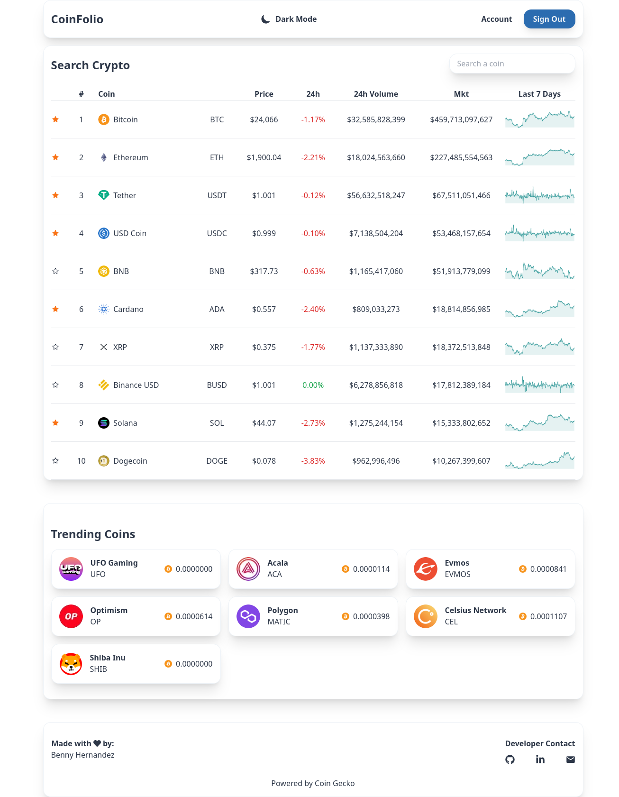

# CoinFolio



#### Top Technologies

[](#) [](#) [](#) [](#) [](#) [](#) [](#)

Coin Folio is a full-stack cryptocurrency web application design to help users track their favorite coins and get a 7 days snapshot of the price. The app was build with next-auth, prisma, google provider for authentication, and trpc as a wrapper for serverless functions. The ui was build with tailwind for theming and dark and light mode.

## Installation

1. Download repository
   ```bash
   git clone https://github.com/Nomad-Freedom/sticky-notes-web.git
   ```
2. Install packages
   ```bash
   yarn install
   ```

## Run in Development

1. add env.local file in root directory

   ```env
    # Prisma

    DATABASE_URL=file:./db.sqlite

    # Next Auth

    NEXTAUTH_SECRET=<<some-secret>>
    NEXTAUTH_URL=http://localhost:3000

    # Next Auth Google Provider

    GOOGLE_CLIENT_ID=<<client-id>>
    GOOGLE_CLIENT_SECRET=<<secret>>
   ```

2. run application
   ```bash
   yarn run dev
   ```

<!-- TODO: Add last video link -->

#### :mailbox: Reach out to me!

- :paperclip: [My Resume/CV](https://github.com/Nomad-Freedom/Nomad-Freedom/blob/main/resume/resume.pdf)
- :email: inquiry@bennyhernandez.com
- :link: [bennyhernandez.com](https://www.bennyhernandez.com)
